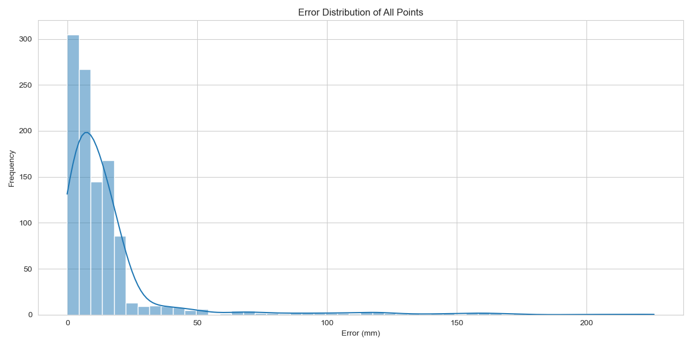
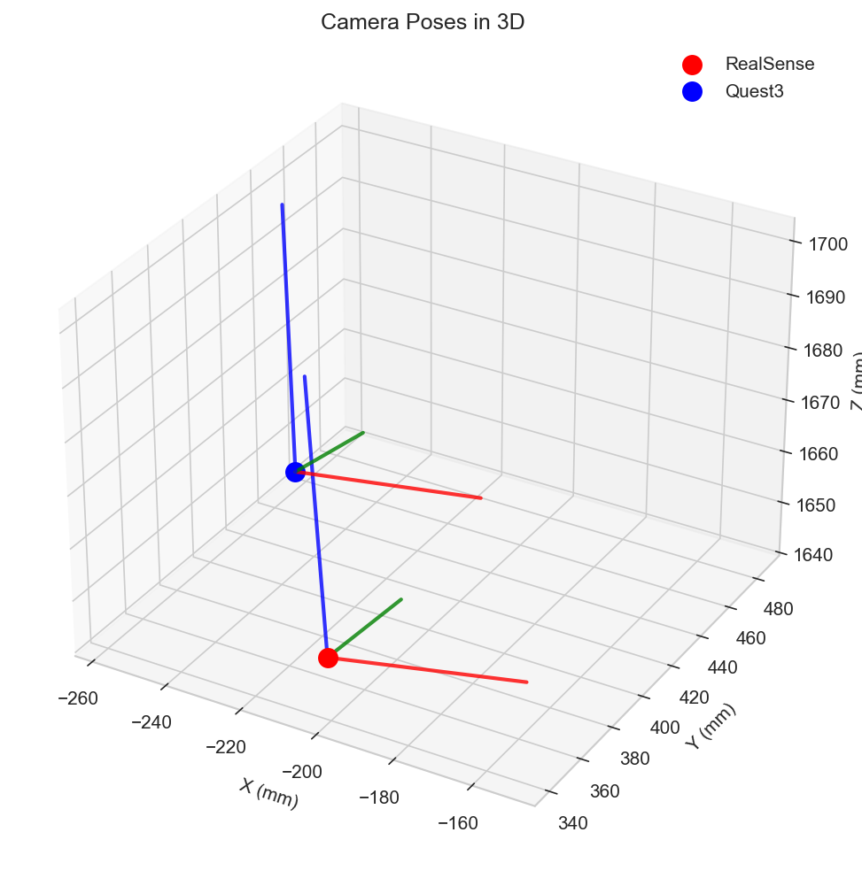
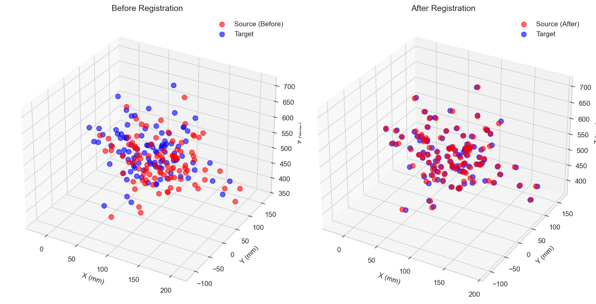

# MetaSenseCalib

<div align="right">
  <a href="README.md">中文</a> | <a href="README.en.md">English</a>
</div>

<div align="center">
  
  
  <div style="margin-top: 20px;">
    
    
    
  </div>
  
  <p style="margin-top: 20px; font-size: 18px;">
    Quest3 + RealSense Extrinsic Calibration Tool | Rich Visualization Support
  </p>
</div>

## 📑 Table of Contents

- [Supported Devices](#-supported-devices)
- [Features](#-features)
- [Installation](#-installation)
- [Quick Start](#-quick-start)
- [Camera Intrinsics](#-camera-intrinsics)
- [Sample Data](#-sample-data)
- [Project Structure](#-project-structure)
- [Visualization Examples](#-visualization-examples)
- [Roadmap](#-roadmap)
- [Contribution](#-contribution)
- [License](#-license)
- [Acknowledgments](#-acknowledgments)

## 📷 Supported Devices

- **Headset**: Meta Quest 3
- **Depth Camera**: Intel RealSense D415

## ✨ Features

- 🎯 **Automatic Chessboard Corner Detection**: High-precision detection of chessboard corners to improve calibration accuracy
- 📊 **Real-time Calibration Visualization**: Intuitive display of key steps during the calibration process
- 📈 **Multiple Error Analysis Charts**: Detailed error analysis to help evaluate calibration quality
- 🔄 **3D Point Cloud Registration Visualization**: Intuitive display of point cloud registration results
- 🎬 **Camera Pose Animation**: Dynamic display of camera pose changes
- 📁 **Batch Processing of Image Pairs**: Efficient processing of multiple calibration image sets
- 💾 **Multiple Format Export**: Support for JSON, NPZ, YAML and other formats

## 📦 Installation

### Step 1: Clone the Project

```bash
git clone https://github.com/yourusername/MetaSenseCalib.git
cd MetaSenseCalib
```

### Step 2: Create Virtual Environment (Recommended)

```bash
# Windows
python -m venv venv
.\venv\Scripts\activate

# Linux/Mac
python3 -m venv venv
source venv/bin/activate
```

### Step 3: Install Dependencies

```bash
pip install -r requirements.txt
```

## 🚀 Quick Start

```python
from calibration import Calibrator

# Create calibrator
calibrator = Calibrator(
    intrinsics_rs="path/to/rs_intrinsics.json",
    intrinsics_q3="path/to/q3_intrinsics.json"
)

# Run calibration
result = calibrator.calibrate(
    image_folder="path/to/calibration/images",
    output_dir="outputs"
)

# View results
print(f"Transformation matrix:\n{result.transformation_matrix}")
print(f"Rotation matrix:\n{result.rotation_matrix}")
print(f"Translation vector: {result.translation_vector}")
print(f"Euler angles (degrees): X={result.euler_angles[0]:.2f}, Y={result.euler_angles[1]:.2f}, Z={result.euler_angles[2]:.2f}")
print(f"Mean error: {result.mean_error:.3f} mm")
print(f"Standard deviation: {result.std_error:.3f} mm")
print(f"Max error: {result.max_error:.3f} mm")
print(f"Min error: {result.min_error:.3f} mm")
```

## 📷 Camera Intrinsics

### Quest 3 Intrinsics

Use Meta Quest 3 SDK in Unity project to get camera intrinsics:

```csharp
using PassthroughCameraSamples;
using System.IO;

// Define intrinsics structure
[System.Serializable]
public struct CameraIntrinsicsJson {
    public FocalLength FocalLength;
    public PrincipalPoint PrincipalPoint;
    public Resolution Resolution;
    public float Skew;
}

[System.Serializable]
public struct FocalLength {
    public float x;
    public float y;
}

[System.Serializable]
public struct PrincipalPoint {
    public float x;
    public float y;
}

[System.Serializable]
public struct Resolution {
    public int x;
    public int y;
}

// Get left or right camera intrinsics
var intrinsics = PassthroughCameraUtils.GetCameraIntrinsics(PassthroughCameraEye.Left);
// Or
var intrinsics = PassthroughCameraUtils.GetCameraIntrinsics(PassthroughCameraEye.Right);

// Build intrinsics object
var intrinsicsJson = new CameraIntrinsicsJson {
    FocalLength = new FocalLength { x = intrinsics.focalLength.x, y = intrinsics.focalLength.y },
    PrincipalPoint = new PrincipalPoint { x = intrinsics.principalPoint.x, y = intrinsics.principalPoint.y },
    Resolution = new Resolution { x = intrinsics.resolution.x, y = intrinsics.resolution.y },
    Skew = intrinsics.skew
};

// Export to JSON format
string json = UnityEngine.JsonUtility.ToJson(intrinsicsJson, true);
File.WriteAllText("q3_intrinsics.json", json);
```

**Output format example**:

```json
{
    "FocalLength": {"x": 869.1344, "y": 869.1344},
    "PrincipalPoint": {"x": 644.6411, "y": 639.2571},
    "Resolution": {"x": 1280, "y": 1280},
    "Skew": 0.0
}
```

### RealSense Intrinsics

Use Intel RealSense SDK to get and save as JSON:

```python
import pyrealsense2 as rs
import json

pipeline = rs.pipeline()
config = rs.config()
config.enable_stream(rs.stream.color, 640, 480, rs.format.bgr8, 30)
profile = pipeline.start(config)

color_profile = profile.get_stream(rs.stream.color)
intrinsics = color_profile.as_video_stream_profile().get_intrinsics()

# Build intrinsics dictionary
intrinsics_dict = {
    "FocalLength": {"x": intrinsics.fx, "y": intrinsics.fy},
    "PrincipalPoint": {"x": intrinsics.ppx, "y": intrinsics.ppy},
    "Resolution": {"x": intrinsics.width, "y": intrinsics.height},
    "Skew": 0.0
}

# Save as JSON file
with open("rs_intrinsics.json", "w") as f:
    json.dump(intrinsics_dict, f, indent=2)
```

## 📊 Sample Data

The project includes sample datasets located in the `data/example/` directory:

```
data/example/
├── rs_0000.png ~ rs_0019.png   # RealSense D415 images (20 images)
├── q3_0000.png ~ q3_0019.png   # Quest3 images (20 images)
└── intrinsics.txt               # Intrinsics information
```

### Run Example

```bash
python examples/rs_q3_calibration.py
```

## 📁 Project Structure

```
MetaSenseCalib/
├── calibration/         # Core calibration algorithms
│   ├── chessboard.py    # Chessboard detection
│   ├── pose.py          # PnP pose estimation
│   └── transform.py     # Rigid body transformation
├── visualization/       # Visualization module
│   ├── poses.py         # Camera pose visualization
│   ├── errors.py        # Error analysis
│   └── pointcloud.py    # 3D point cloud
└── examples/            # Usage examples
```

## 📊 Visualization Examples

### Feature Showcase

| Chessboard Detection | Error Distribution |
|---------------------|-------------------|
|  |  |

| 3D Poses | Registration Comparison |
|----------|------------------------|
|  |  |

## 📋 Roadmap

- [ ] Real-time video stream calibration
- [ ] Multi-camera simultaneous calibration
- [ ] Hand-eye calibration support
- [ ] Unity integration example
- [ ] Web interface
- [ ] Automatic distortion correction

## 🤝 Contribution

Welcome to submit Pull Requests! We greatly appreciate community contributions, whether it's feature improvements, bug fixes, or documentation enhancements.

## 📄 License

This project is licensed under the MIT License. See the [LICENSE](LICENSE) file for details.

## 🙏 Acknowledgments

- **OpenCV**: Provides powerful computer vision algorithms
- **NumPy**: Provides efficient numerical computing support
- **SciPy**: Provides scientific computing tools
- **Matplotlib**: Provides data visualization functionality

---

<div align="center">
  <p>Made with ❤️ for XR Calibration</p>
</div>