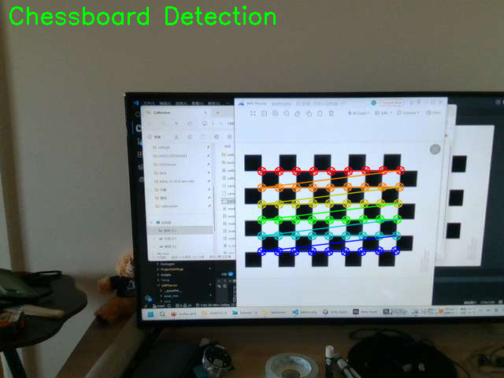
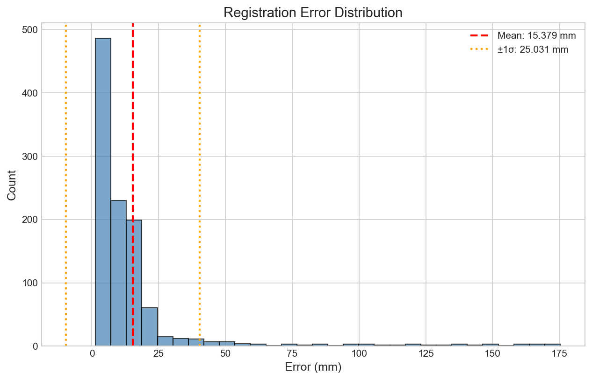

# MetaSenseCalib

<div align="center">
  
  
  <div style="margin-top: 20px;">
    
    
    
  </div>
  
  <p style="margin-top: 20px; font-size: 18px;">
    Quest3 + RealSense 外参标定工具 | 丰富的可视化支持
  </p>
</div>

## 📑 目录

- [支持的设备](#-支持的设备)
- [特性](#-特性)
- [安装](#-安装)
- [快速开始](#-快速开始)
- [获取相机内参](#-获取相机内参)
- [示例数据](#-示例数据)
- [项目结构](#-项目结构)
- [可视化示例](#-可视化示例)
- [待实现功能](#-待实现功能)
- [贡献](#-贡献)
- [许可证](#-许可证)
- [致谢](#-致谢)

## 📷 支持的设备

- **Headset**: Meta Quest 3
- **Depth Camera**: Intel RealSense D415

## ✨ 特性

- 🎯 **自动棋盘格角点检测**：高精度识别棋盘格角点，提高标定精度
- 📊 **实时可视化标定过程**：直观展示标定过程中的关键步骤
- 📈 **多种误差分析图表**：详细的误差分析，帮助评估标定质量
- 🔄 **3D点云配准可视化**：直观展示点云配准效果
- 🎬 **相机位姿动画展示**：动态展示相机位姿变化
- 📁 **支持批量处理图像对**：高效处理多组标定图像
- 💾 **多种格式导出**：支持 JSON、NPZ、YAML 等多种格式

## 📦 安装

### 步骤 1: 克隆项目

```bash
git clone https://github.com/yourusername/MetaSenseCalib.git
cd MetaSenseCalib
```

### 步骤 2: 创建虚拟环境（推荐）

```bash
# Windows
python -m venv venv
.\venv\Scripts\activate

# Linux/Mac
python3 -m venv venv
source venv/bin/activate
```

### 步骤 3: 安装依赖

```bash
pip install -r requirements.txt
```

## 🚀 快速开始

```python
from calibration import Calibrator

# 创建标定器
calibrator = Calibrator(
    intrinsics_rs="path/to/rs_intrinsics.json",
    intrinsics_q3="path/to/q3_intrinsics.json"
)

# 运行标定
result = calibrator.calibrate(
    image_folder="path/to/calibration/images",
    output_dir="outputs"
)

# 查看结果
print(f"变换矩阵:\n{result.transformation_matrix}")
print(f"旋转矩阵:\n{result.rotation_matrix}")
print(f"平移向量: {result.translation_vector}")
print(f"旋转角度 (度): X={result.euler_angles[0]:.2f}, Y={result.euler_angles[1]:.2f}, Z={result.euler_angles[2]:.2f}")
print(f"平均误差: {result.mean_error:.3f} mm")
print(f"标准差: {result.std_error:.3f} mm")
print(f"最大误差: {result.max_error:.3f} mm")
print(f"最小误差: {result.min_error:.3f} mm")
```

## 📷 获取相机内参

### Quest 3 内参

在 Unity 项目中使用 Meta Quest 3 SDK 获取相机内参：

```csharp
using PassthroughCameraSamples;
using System.IO;

// 定义内参结构体
[System.Serializable]
public struct CameraIntrinsicsJson {
    public FocalLength FocalLength;
    public PrincipalPoint PrincipalPoint;
    public Resolution Resolution;
    public float Skew;
}

[System.Serializable]
public struct FocalLength {
    public float x;
    public float y;
}

[System.Serializable]
public struct PrincipalPoint {
    public float x;
    public float y;
}

[System.Serializable]
public struct Resolution {
    public int x;
    public int y;
}

// 获取左眼或右眼相机内参
var intrinsics = PassthroughCameraUtils.GetCameraIntrinsics(PassthroughCameraEye.Left);
// 或
var intrinsics = PassthroughCameraUtils.GetCameraIntrinsics(PassthroughCameraEye.Right);

// 构建内参对象
var intrinsicsJson = new CameraIntrinsicsJson {
    FocalLength = new FocalLength { x = intrinsics.focalLength.x, y = intrinsics.focalLength.y },
    PrincipalPoint = new PrincipalPoint { x = intrinsics.principalPoint.x, y = intrinsics.principalPoint.y },
    Resolution = new Resolution { x = intrinsics.resolution.x, y = intrinsics.resolution.y },
    Skew = intrinsics.skew
};

// 导出为 JSON 格式
string json = UnityEngine.JsonUtility.ToJson(intrinsicsJson, true);
File.WriteAllText("q3_intrinsics.json", json);
```

**输出格式示例**：

```json
{
    "FocalLength": {"x": 869.1344, "y": 869.1344},
    "PrincipalPoint": {"x": 644.6411, "y": 639.2571},
    "Resolution": {"x": 1280, "y": 1280},
    "Skew": 0.0
}
```

### RealSense 内参

使用 Intel RealSense SDK 获取并保存为 JSON：

```python
import pyrealsense2 as rs
import json

pipeline = rs.pipeline()
config = rs.config()
config.enable_stream(rs.stream.color, 640, 480, rs.format.bgr8, 30)
profile = pipeline.start(config)

color_profile = profile.get_stream(rs.stream.color)
intrinsics = color_profile.as_video_stream_profile().get_intrinsics()

# 构建内参字典
intrinsics_dict = {
    "FocalLength": {"x": intrinsics.fx, "y": intrinsics.fy},
    "PrincipalPoint": {"x": intrinsics.ppx, "y": intrinsics.ppy},
    "Resolution": {"x": intrinsics.width, "y": intrinsics.height},
    "Skew": 0.0
}

# 保存为 JSON 文件
with open("rs_intrinsics.json", "w") as f:
    json.dump(intrinsics_dict, f, indent=2)
```

## 📊 示例数据

项目包含示例数据集，位于 `data/example/` 目录：

```
data/example/
├── rs_0000.png ~ rs_0019.png   # RealSense D415 图像 (20张)
├── q3_0000.png ~ q3_0019.png   # Quest3 图像 (20张)
└── intrinsics.txt               # 内参信息
```

### 运行示例

```bash
python examples/rs_q3_calibration.py
```

## 📁 项目结构

```
MetaSenseCalib/
├── calibration/         # 核心标定算法
│   ├── chessboard.py    # 棋盘格检测
│   ├── pose.py          # PnP位姿估计
│   └── transform.py     # 刚体变换
├── visualization/       # 可视化模块
│   ├── poses.py         # 相机位姿可视化
│   ├── errors.py        # 误差分析
│   └── pointcloud.py    # 3D点云
└── examples/            # 使用示例
```

## 📊 可视化示例

### 功能展示

| 棋盘格检测 | 误差分布 |
|------------|----------|
|  |  |

| 3D位姿 | 配准对比 |
|--------|----------|
|  |  |

## 📋 待实现功能

- [ ] 实时视频流标定
- [ ] 多相机同时标定
- [ ] 手眼标定支持
- [ ] Unity 集成示例
- [ ] Web 界面
- [ ] 自动畸变校正

## 🤝 贡献

欢迎提交 Pull Request！我们非常感谢社区的贡献，无论是功能改进、Bug 修复还是文档完善。

## 📄 许可证

本项目采用 MIT 许可证。详见 [LICENSE](LICENSE) 文件。

## 🙏 致谢

- **OpenCV**：提供强大的计算机视觉算法
- **NumPy**：提供高效的数值计算支持
- **SciPy**：提供科学计算工具
- **Matplotlib**：提供数据可视化功能

---

<div align="center">
  <p>Made with ❤️ for XR Calibration</p>
</div>
