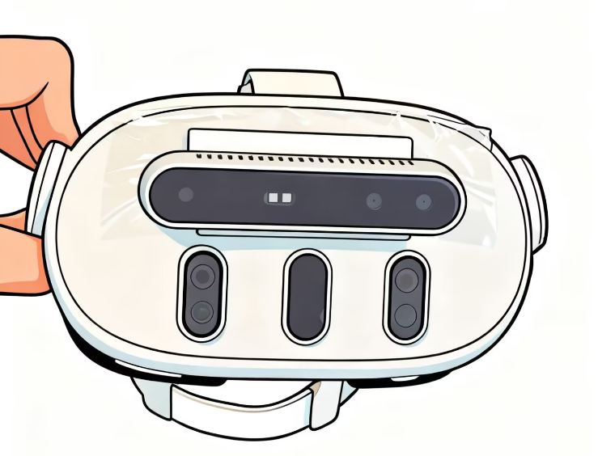

# MetaSenseCalib

<div align="right">
  <a href="README.cn.md">中文</a> | <a href="README.md">English</a>
</div>

<div align="center">
  
  
  <div style="margin-top: 20px;">
    
    
    
  </div>
  
  <p style="margin-top: 20px; font-size: 18px;">
    Quest3 + RealSense Camera Calibration Tool | Enable Pixel-to-Pixel Conversion Between Cameras
  </p>
</div>

## 📚 Related Resources

- **Reference**：[MIT Vision Book - Imaging Geometry](https://visionbook.mit.edu/imaging_geometry.html)

## 📑 Table of Contents

- [Final Goal of Calibration](#-final-goal-of-calibration)
- [What are Intrinsics](#-what-are-intrinsics)
- [What are Extrinsics](#-what-are-extrinsics)
- [Quick Start](#-quick-start)
- [Sample Data](#-sample-data)
- [Detailed Documentation](#-detailed-documentation)
- [Contribution](#-contribution)
- [License](#-license)

## 🎯 Final Goal of Calibration

The core goal of camera calibration is **to enable pixel-to-pixel conversion between two cameras**. Through calibration, we can:

- Convert pixel coordinates from RealSense camera to Quest3 camera
- Convert pixel coordinates from Quest3 camera to RealSense camera
- Achieve spatial alignment between the two cameras, allowing them to "see" the same 3D world

## 📷 What are Intrinsics

**Intrinsics** describe the internal optical characteristics of a camera, defining the **mapping relationship between pixels and 3D space**:

- **Focal Length**: Controls the camera's field of view and magnification
- **Principal Point**: The intersection of the camera's optical axis with the imaging plane
- **Distortion Coefficients**: Correct lens distortion

The essence of intrinsics calibration is to establish a mapping from pixel coordinates to spatial rays. Each pixel corresponds to a ray in space that starts from the camera's optical center, passes through the pixel, and extends to infinity.

## 🌍 What are Extrinsics

**Extrinsics** describe the **relative position and orientation between two cameras**, assuming they are in different 3D reference frames:

- **Rotation Matrix**: Describes the rotation of one camera relative to another
- **Translation Vector**: Describes the position offset of one camera relative to another

The essence of extrinsics calibration is to find a rigid body transformation that converts one camera's 3D coordinate system to another camera's 3D coordinate system.

## 🚀 Quick Start

```python
from calibration import Calibrator

# Create calibrator
calibrator = Calibrator(
    intrinsics_rs="data/example/rs_intrinsics.json",
    intrinsics_q3="data/example/q3_intrinsics.json"
)

# Run calibration
result = calibrator.calibrate(
    image_folder="data/example",
    output_dir="outputs/example/extrinsics"
)

# View results
print(f"Transformation matrix:\n{result.transformation_matrix}")
print(f"Rotation matrix:\n{result.rotation_matrix}")
print(f"Translation vector: {result.translation_vector}")
print(f"Euler angles (degrees): X={result.euler_angles[0]:.2f}, Y={result.euler_angles[1]:.2f}, Z={result.euler_angles[2]:.2f}")
print(f"Mean error: {result.mean_error:.3f} mm")
```

##  Sample Data

The project includes sample datasets located in the `data/example/` directory:

```
data/example/
├── rs_0000.png ~ rs_0019.png   # RealSense D415 images (20 images)
├── q3_0000.png ~ q3_0019.png   # Quest3 images (20 images)
├── rs_intrinsics.json          # RealSense intrinsics
└── q3_intrinsics.json           # Quest3 intrinsics
```

### Run Examples

```bash
# Intrinsics calibration visualization
python examples/intr-visual.py

# Extrinsics calibration demo
python examples/extr-demo.py
```

## 📹 Video Demo

The following video demonstrates the pixel conversion effect after camera calibration, showing the view transformation between RealSense and Quest3 cameras:


The video file is located at `docs/videos/warp_demo.mp4` in the project.

## 📚 Detailed Documentation

For more detailed calibration principles and result analysis, please refer to:

- **Chinese Documentation**: [docs/zh/](docs/zh/)
- **English Documentation**: [docs/en/](docs/en/)

Detailed documentation includes:
- Complete steps and principles of intrinsics calibration
- Mathematical principles of extrinsic rigid body calibration
- Detailed analysis of actual calibration results
- Error evaluation and optimization suggestions

## 🛠️ Core OpenCV Functions

Key OpenCV functions used in this project:

### Chessboard Detection and Corner Localization
- `cv2.findChessboardCorners` - Detect chessboard corners
- `cv2.cornerSubPix` - Sub-pixel corner localization
- `cv2.drawChessboardCorners` - Visualize chessboard corners

### Camera Pose Estimation
- `cv2.solvePnP` - Solve camera pose
- `cv2.Rodrigues` - Convert between rotation vector and rotation matrix
- `cv2.projectPoints` - Project 3D points to 2D image plane

### Image Processing
- `cv2.cvtColor` - Convert image color space
- `cv2.imread` - Read image
- `cv2.imwrite` - Save image
- `cv2.resize` - Resize image

### Optimization Parameters
- `cv2.TERM_CRITERIA_EPS` - Termination criteria for corner localization (precision)
- `cv2.TERM_CRITERIA_MAX_ITER` - Termination criteria for corner localization (maximum iterations)
- `cv2.SOLVEPNP_ITERATIVE` - Iterative method for solvePnP

## 🤝 Contribution

Welcome to submit Pull Requests! We greatly appreciate community contributions, whether it's feature improvements, bug fixes, or documentation enhancements.

## 📄 License

This project is licensed under the MIT License. See the [LICENSE](LICENSE) file for details.

---

<div align="center">
  <p>Made with ❤️ for XR Calibration</p>
</div>
