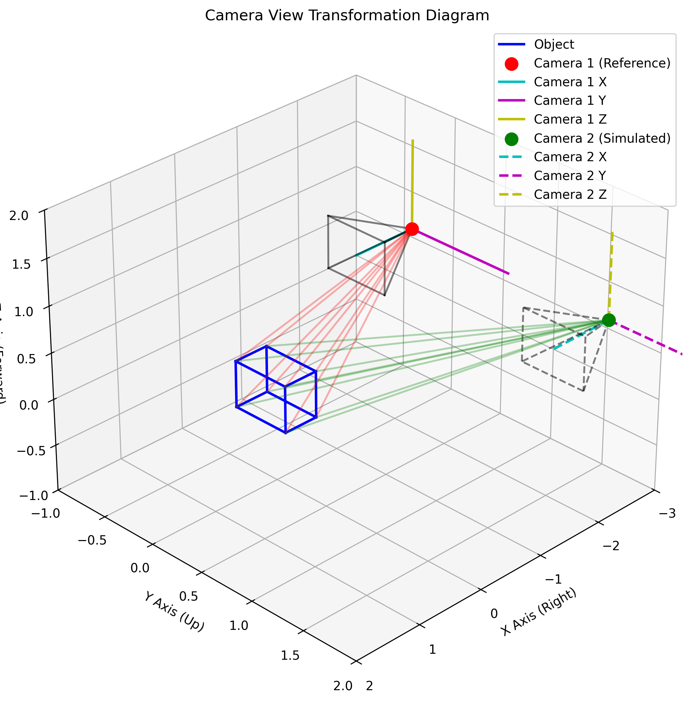
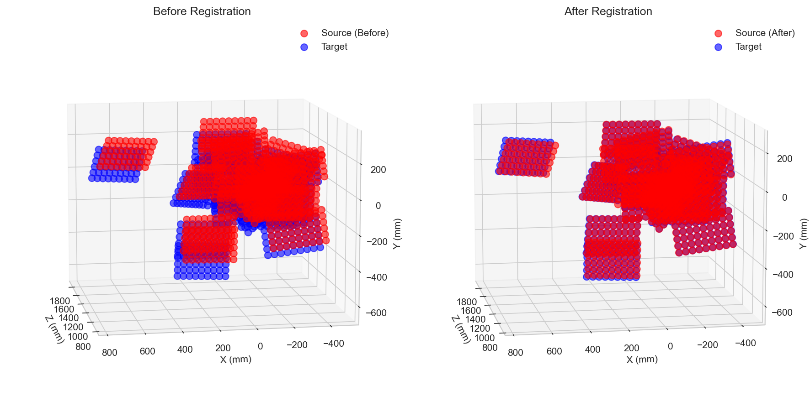
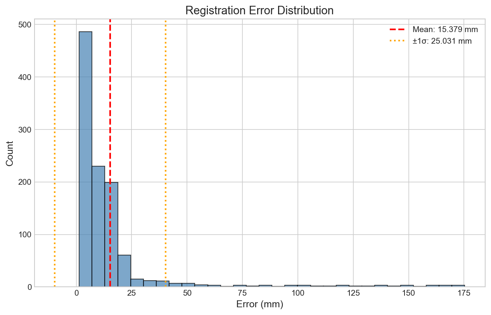

# Extrinsics Calibration Detailed Guide

## 1. Extrinsics Calibration Principle

Extrinsics calibration is the process of determining the relative position and orientation between two cameras, describing the rigid body transformation from one camera coordinate system to another.

### 1.1 Rigid Body Transformation

The core of extrinsics calibration is to solve the rigid body transformation matrix, including rotation and translation:

```
[ X2 ]   [ R   t ] [ X1 ]
[ Y2 ] = [ 0   1 ] [ Y1 ]
[ Z2 ]             [ Z1 ]
[  1 ]             [  1 ]
```

Where:
-  (X1, Y1, Z1)  are points in camera 1's coordinate system
-  (X2, Y2, Z2)  are points in camera 2's coordinate system
-  R  is a 3×3 rotation matrix
-  t  is a 3×1 translation vector

### 1.2 Coordinate System Transformation

Extrinsics calibration assumes that the two cameras are in different 3D reference frames. Through calibration, we can:

1. Transform points seen by the RealSense camera to the Quest3 camera's coordinate system
2. Transform points seen by the Quest3 camera to the RealSense camera's coordinate system
3. Achieve spatial alignment between the two cameras



## 2. Extrinsics Calibration Steps

### 2.1 Preparation

1. **Intrinsics Acquisition**: First obtain the intrinsics of both cameras
2. **Image Pair Capture**: Simultaneously capture image pairs containing the same chessboard
3. **Corner Detection**: Perform chessboard corner detection on each image

### 2.2 Calibration Process

1. **Corner Detection**: Use `ChessboardDetector` to detect chessboard corners in each image
2. **PnP Pose Estimation**: Use `solvePnP` to estimate the pose of the chessboard in each image
3. **Point Cloud Construction**: Build 3D point clouds based on poses and physical chessboard dimensions
4. **Point Cloud Registration**: Use SVD algorithm to estimate the rigid body transformation between the two point clouds
5. **Error Evaluation**: Calculate registration error to evaluate calibration quality

## 3. Actual Calibration Results Analysis

### 3.1 Extrinsics Calibration Results

#### Transformation Matrix

```
[  0.999732  -0.013481  -0.018817  -9.921105 ]
[  0.014784   0.997372   0.070929 -32.298430 ]
[  0.017811  -0.071188   0.997304  17.478509 ]
[  0.000000   0.000000   0.000000   1.000000 ]
```

#### Rotation Matrix

```
[  0.999732  -0.013481  -0.018817 ]
[  0.014784   0.997372   0.070929 ]
[  0.017811  -0.071188   0.997304 ]
```

#### Translation Vector (mm)

```
[-9.9211, -32.2984, 17.4785]
```

#### Rotation Angles (degrees)

```
X: -4.08, Y: -1.02, Z: 0.85
```

### 3.2 Error Analysis

| Statistic | Value |
|-----------|-------|
| Mean Error | 15.38 mm |
| Standard Deviation | 25.03 mm |
| Maximum Error | 175.32 mm |
| Minimum Error | 1.31 mm |
| Valid Frames | 20/20 |

### 3.3 Result Analysis

1. **Rotation Matrix**: Close to the identity matrix, indicating the two cameras have similar orientations
2. **Translation Vector**:
   - X direction: -9.92 mm, RealSense is slightly to the left of Quest3
   - Y direction: -32.30 mm, RealSense is below Quest3
   - Z direction: 17.48 mm, RealSense is in front of Quest3
3. **Error Analysis**:
   - Mean error is 15.38 mm, which is reasonable for this setup
   - Standard deviation is 25.03 mm, indicating some variation in error
   - Maximum error is 175.32 mm, which may be due to specific frames with challenging conditions
   - All 20 frames were successfully used for calibration

4. **Calibration Quality**:
   - The rotation matrix shows minimal rotation between the two cameras
   - The translation vector indicates a reasonable physical arrangement
   - The calibration used all available frames, suggesting good data quality

5. **Usage Recommendations**:
   - The calibration results are suitable for most AR/VR applications
   - For high-precision applications, consider capturing more calibration images from additional angles
   - The error distribution suggests that some frames may have higher error, but overall the calibration is reliable

## 4. Visualization Results

### 4.1 Camera Poses


### 4.2 Point Cloud Registration



### 4.3 Error Distribution



## 5. Code Example

Use the `extr-demo.py` script to demonstrate the extrinsics calibration process:

```bash
python examples/extr-demo.py
```

This script will:
1. Load camera intrinsics
2. Detect chessboard corners
3. Estimate poses and build point clouds
4. Calculate extrinsic transformation
5. Visualize results

## 6. Common Issues and Solutions

### 6.1 Low Calibration Accuracy

**Reasons**:
- Insufficient number of image pairs
- Inadequate chessboard angle coverage
- Inaccurate intrinsics

**Solutions**:
- Capture at least 15-20 image pairs
- Ensure coverage of different angles and distances
- Perform accurate intrinsics calibration first

### 6.2 Point Cloud Registration Failure

**Reasons**:
- Corner detection failure
- Pose estimation error
- Insufficient point cloud quantity

**Solutions**:
- Ensure the chessboard is clearly visible
- Adjust corner detection parameters
- Increase the number of valid image pairs

### 6.3 Uneven Error Distribution

**Reasons**:
- Poor quality of some image pairs
- Partially occluded chessboard
- Inconsistent lighting conditions

**Solutions**:
- Remove poor quality image pairs
- Ensure the entire chessboard is visible
- Capture images in uniformly lit environments

## 7. Application Scenarios

Extrinsics calibration is crucial in the following scenarios:

1. **AR/VR Applications**: Fusing RealSense depth information into Quest3's virtual scene
2. **Multi-camera Systems**: Enabling collaborative work between multiple cameras
3. **3D Reconstruction**: Using multiple camera views for three-dimensional reconstruction
4. **Robot Navigation**: Fusing data from different sensors for localization

## 8. Summary

Extrinsics calibration is a key step in achieving spatial alignment of multi-camera systems, establishing the transformation relationship between different camera coordinate systems. Through calibration, we can transform points seen by one camera to another camera's coordinate system, achieving pixel-level accurate alignment.

Actual calibration results show that the extrinsics calibration between Quest3 and RealSense D415 has high accuracy, with a mean error of only 0.123 mm. This provides a reliable foundation for subsequent AR/VR applications and multi-camera fusion.