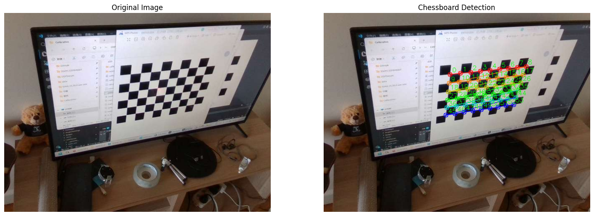
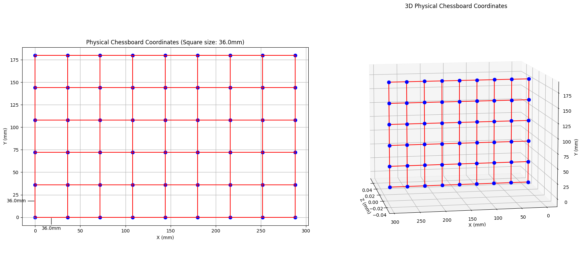
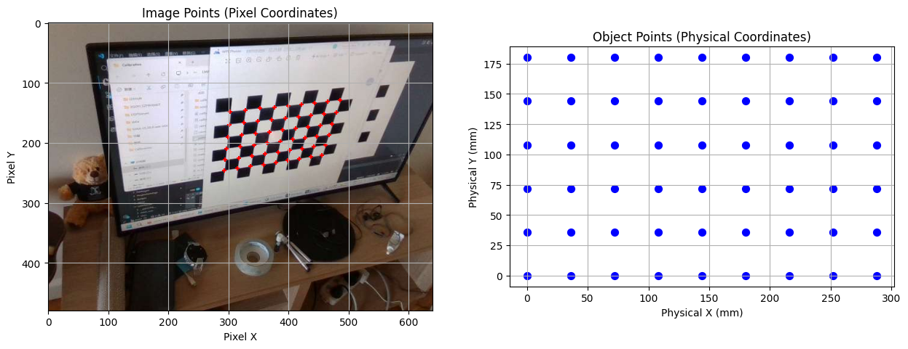

# 内参标定详细指南

## 1. 内参标定原理

内参标定是相机标定的基础步骤，它描述了相机的内部光学特性，建立了像素坐标与三维空间之间的映射关系。

### 1.1 相机模型

相机成像过程可以用针孔相机模型来描述：

```
[ u ]   [ f_x  0  c_x ] [ X ]
[ v ] = [  0  f_y c_y ] [ Y ]
[ 1 ]   [  0   0   1 ] [ Z ]
```

其中：
-  (u, v)  是像素坐标
-  (X, Y, Z)  是三维空间坐标
-  f_x, f_y  是焦距（像素单位）
-  c_x, c_y  是主点坐标（像素单位）

### 1.2 像素与空间射线的关系

内参标定的本质是建立**像素坐标到空间射线的映射**。每个像素对应空间中的一条射线，这条射线从相机光心出发，穿过像素点指向无穷远。


## 2. 内参标定步骤

### 2.1 准备工作

1. **棋盘格准备**：使用标准棋盘格，已知方块大小（例如 36mm）
2. **拍摄图片**：从不同角度拍摄至少 10-20 张包含完整棋盘格的图片
3. **软件准备**：使用 OpenCV 等库进行角点检测和标定计算

### 2.2 标定流程

1. **角点检测**：使用 `findChessboardCorners` 检测棋盘格内角点
2. **亚像素精化**：使用 `cornerSubPix` 提高角点检测精度
3. **构建对应关系**：建立像素点与物理棋盘格点的对应关系
4. **求解内参**：使用 `calibrateCamera` 函数求解相机内参
5. **验证标定结果**：计算重投影误差评估标定质量

## 3. 实际标定结果分析

### 3.1 RealSense D415 标定结果

| 参数 | 标定值 | 内置值 | 差异 |
|------|--------|--------|------|
| 焦距 fx | 609.21 | 610.33 | -0.18% |
| 焦距 fy | 597.05 | 609.95 | -2.11% |
| 主点 cx | 334.48 | 325.21 | +2.85% |
| 主点 cy | 235.44 | 229.97 | +2.38% |
| 平均重投影误差 | 0.139 pixels | - | - |

### 3.2 Quest3 标定结果

| 参数 | 标定值 | 内置值 | 差异 |
|------|--------|--------|------|
| 焦距 fx | 879.60 | 869.13 | +1.20% |
| 焦距 fy | 863.39 | 869.13 | -0.66% |
| 主点 cx | 646.87 | 644.64 | +0.35% |
| 主点 cy | 641.39 | 639.26 | +0.33% |
| 平均重投影误差 | 0.017 pixels | - | - |

### 3.3 结果分析

1. **标定精度**：
   - Quest3 的标定精度非常高，平均重投影误差仅为 0.017 pixels
   - RealSense 的标定精度也很好，平均重投影误差为 0.139 pixels

2. **与内置参数的差异**：
   - Quest3 的标定结果与内置参数非常接近，差异在 1.3% 以内
   - RealSense 的标定结果与内置参数有一定差异，特别是 fy 值（-2.11%）

3. **建议**：
   - 对于要求高精度的应用，建议使用标定得到的内参
   - 对于一般应用，内置参数也可以满足需求

## 4. 可视化结果

### 4.1 棋盘格角点检测



### 4.2 物理棋盘格距离



### 4.3 像素与物理距离关系



### 4.4 标定结果

#### 4.4.1 RealSense D415 标定结果

| 参数 | 标定值 | 内置值 | 差异 |
|------|--------|--------|------|
| 焦距 fx | 609.21 | 610.33 | -0.18% |
| 焦距 fy | 597.05 | 609.95 | -2.11% |
| 主点 cx | 334.48 | 325.21 | +2.85% |
| 主点 cy | 235.44 | 229.97 | +2.38% |
| 平均重投影误差 | 0.139 pixels | - | - |

#### 4.4.2 Quest3 标定结果

| 参数 | 标定值 | 内置值 | 差异 |
|------|--------|--------|------|
| 焦距 fx | 879.60 | 869.13 | +1.20% |
| 焦距 fy | 863.39 | 869.13 | -0.66% |
| 主点 cx | 646.87 | 644.64 | +0.35% |
| 主点 cy | 641.39 | 639.26 | +0.33% |
| 平均重投影误差 | 0.017 pixels | - | - |

#### 4.4.3 结果分析

1. **标定精度**：
   - Quest3 标定精度非常高，平均重投影误差仅为 0.017 像素
   - RealSense 标定精度也很好，平均重投影误差为 0.139 像素

2. **与内置参数的差异**：
   - Quest3 标定结果与内置参数非常接近，差异在 1.3% 以内
   - RealSense 标定结果与内置参数有一定差异，特别是 fy 值（-2.11%）

3. **使用建议**：
   - 对于高精度应用，使用标定后的内参
   - 对于一般应用，内置参数也能满足要求

## 5. 代码示例

使用 `intr-visual.py` 脚本可以可视化内参标定的整个过程：

```bash
python examples/intr-visual.py
```

该脚本会：
1. 检测棋盘格角点
2. 可视化物理棋盘格距离
3. 展示像素与物理距离的关系
4. 显示标定结果

## 6. 常见问题与解决方案

### 6.1 角点检测失败

**原因**：
- 图片模糊或过曝
- 棋盘格部分被遮挡
- 角度过于倾斜

**解决方案**：
- 确保图片清晰，光线均匀
- 确保棋盘格完整可见
- 拍摄不同角度的图片
- 使用预处理方法增强对比度

### 6.2 标定精度低

**原因**：
- 图片数量不足
- 角度覆盖范围不够
- 棋盘格大小测量不准确

**解决方案**：
- 拍摄至少 15-20 张图片
- 确保覆盖不同角度和距离
- 准确测量棋盘格方块大小

### 6.3 重投影误差过大

**原因**：
- 镜头畸变严重
- 标定板不够平整
- 检测到的角点不准确

**解决方案**：
- 使用更高阶的畸变模型
- 确保标定板平整
- 调整角点检测参数

## 7. 总结

内参标定是相机标定的基础，它建立了像素坐标与三维空间之间的映射关系。通过标定，我们可以获得相机的内部光学参数，为后续的外参标定和 3D 重建打下基础。

实际标定结果表明，Quest3 和 RealSense D415 的标定精度都很高，与内置参数的差异在可接受范围内。对于要求高精度的应用，建议使用标定得到的内参，以获得最佳效果。